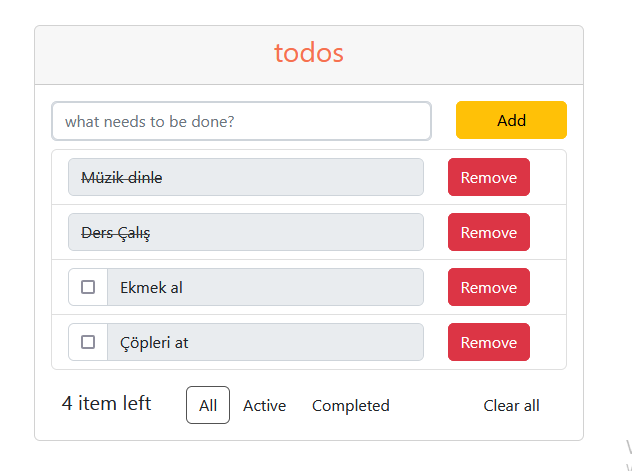
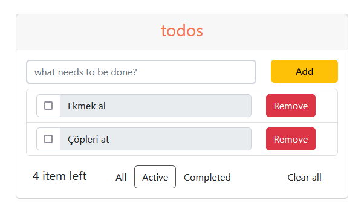
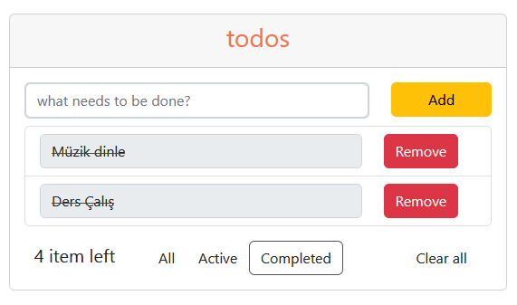
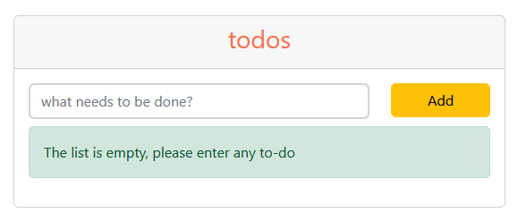

### todos app

### repoyu klonlayın 
```
git clone https://github.com/EmirhanAltuntas/patika-react-tasks.git
```

### klasör dizinine gidin ve visul studio code ile açın
```
cd task2-todos-app
code .
```

### eksik paketleri kurun
```
npm install
```








