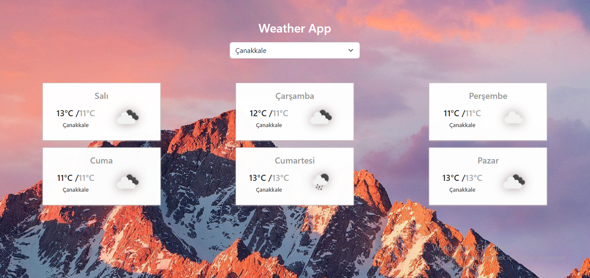
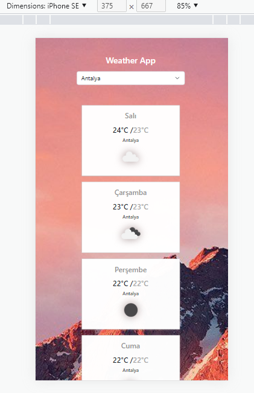

### weather-forecast-app

### repoyu klonlayın 
```
git clone https://github.com/EmirhanAltuntas/patika-react-tasks.git
```

### klasör dizinine gidin ve visul studio code ile açın
```
cd task3-weather-app
code .
```

### eksik paketleri kurun
```
npm install
```

### openweathermap.org sitesine kayıt olup bir api key alın 
[openweathermap](https://openweathermap.org/)

### projede api_key değişkenine bu keyi verin ve projeyi çalıştırın
```
npm start
```





